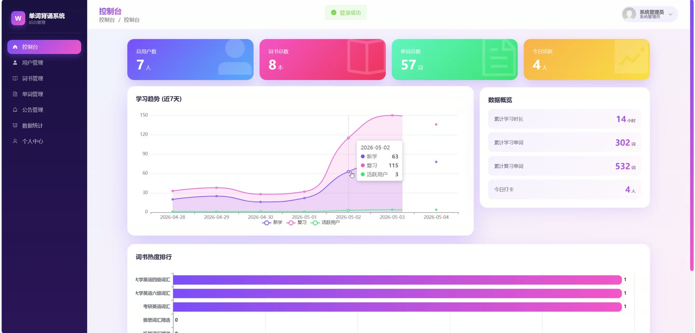
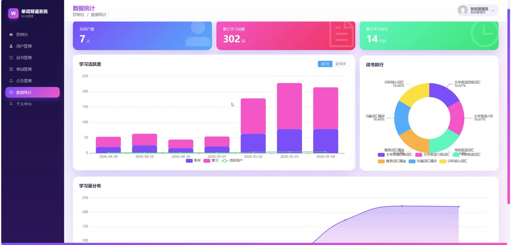
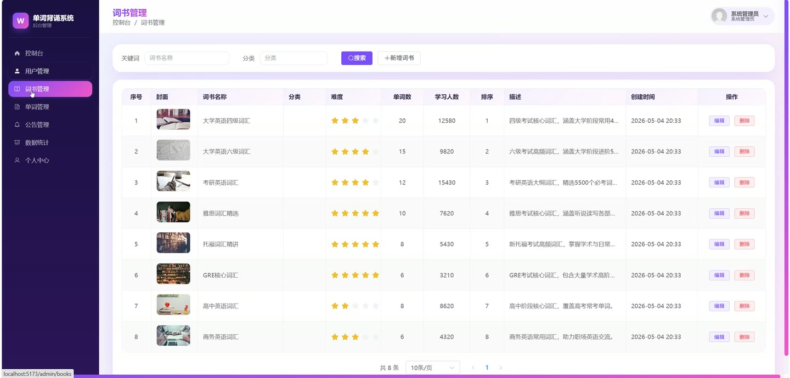

# (附文档)Springboot3+Vue3+MySQL 单词背诵系统

**技术栈**：Springboot3、Vue3、MySQL

### 系统简介

本系统是一套基于 Spring Boot 3 + Vue 3 的单词背诵与学习管理系统，采用前后端分离架构。系统包含用户端和管理员端两大角色，用户端提供单词学习、复习、测试、错题本、收藏、学习数据统计等功能；管理员端提供词书管理、单词管理、用户管理、公告管理、数据总览等功能。
 
### 核心功能
 
### 用户端

 
- 用户认证与个人中心  
- 用户注册：填写用户名、密码、手机号、昵称完成注册，支持用户名唯一性校验 
- 用户登录：支持用户名或手机号登录，校验密码并生成 JWT Token 
- 找回密码：通过用户名与手机号匹配后重置密码 
- 修改密码：输入原密码与新密码完成修改 
- 更新个人信息：修改昵称、头像、邮箱、性别、个性签名 
- 切换当前词书：选择词书后更新用户当前学习词书 ID 
- 查看个人信息：获取当前登录用户的完整信息   
- 词书浏览与选择  
- 词书列表：按排序号和创建时间降序展示所有词书 
- 词书详情：查看单本词书的名称、分类、单词总数等详细信息   
- 单词学习与复习（艾宾浩斯曲线）  
- 获取新学单词：从指定词书中获取用户未学习的单词列表，支持限制返回数量 
- 获取复习单词：根据艾宾浩斯遗忘曲线获取当前需要复习的单词，按下次复习时间升序排列 
- 提交学习结果：记录单词答对/答错，答对则进入下一复习阶段，答错则回到第一阶段 
- 艾宾浩斯复习间隔：5分钟、30分钟、12小时、1天、2天、4天、7天、15天共8个阶段 
- 标记已掌握：直接标记单词为已掌握状态，跳过后续复习 
- 每日打卡：记录今日学习打卡，自动计算连续打卡天数   
- 单词查询与筛选  
- 分页查询单词：支持按词书、单元、难度星级、关键字（单词/释义）筛选 
- 状态过滤：按未学、已学、已掌握、未掌握筛选单词 
- 收藏筛选：仅查看已收藏或未收藏的单词 
- 单词详情：查看单词的完整信息，包括音标、释义、例句、词源、记忆技巧、相关短语、音频链接 
- 单词列表附加用户学习状态：展示当前用户对该单词的掌握程度、复习阶段等   
- 收藏管理  
- 收藏列表：查看所有已收藏的单词，按更新时间降序排列 
- 切换收藏：对指定单词进行收藏或取消收藏操作   
- 错题本  
- 错题列表：查看所有答错的单词，按最近答错时间降序排列 
- 删除单个错题：从错题本中移除指定单词 
- 清空错题本：一键清空当前用户的所有错题记录   
- 单词测试  
- 生成测试题目：支持英译中、中译英、拼写、听力四种题型，随机生成选项 
- 提交测试结果：记录测试总分、正确/错误数量、用时，答错单词自动加入错题本 
- 测试记录：查看最近20条测试记录，包含分数、题数、测试类型等   
- 学习数据统计  
- 学习总览：展示今日新学单词数、复习单词数、学习分钟数、是否已打卡 
- 累计数据：展示累计学习分钟数、已学单词总数、已掌握单词数、待复习单词数 
- 学习趋势图：最近N天（默认7天）的新学、复习、学习分钟数趋势数据 
- 记忆曲线数据：展示8个复习阶段的单词分布数量及标准遗忘曲线理论值   
- 公告查看  
- 公告列表：分页查看已发布的公告，按创建时间降序排列 
- 公告详情：查看公告完整内容，访问时自动增加阅读量  
 
### 管理员端

 
- 用户管理  
- 用户分页列表：按用户名、昵称、手机号模糊搜索，按状态筛选，排除管理员账号 
- 禁用/启用用户：切换用户账号的启用状态 
- 删除用户：删除普通用户账号，禁止删除管理员账号 
- 查看用户学习数据：查看指定用户的已学单词数、已掌握单词数、最近30条学习记录   
- 词书管理  
- 词书分页列表：按名称模糊搜索、按分类筛选 
- 新增词书：添加词书名称、分类、排序号等信息 
- 编辑词书：修改词书的名称、分类、排序号等 
- 删除词书：删除词书及其下所有单词 
- 词书详情：查看单本词书的完整信息   
- 单词管理  
- 单词分页列表：按词书、单元、难度、关键字筛选 
- 新增单词：添加单词的拼写、音标、释义、例句、词源、记忆技巧、相关短语、难度等 
- 编辑单词：修改单词的所有字段 
- 删除单词：删除指定单词并自动更新词书单词总数 
- 单词详情：查看单词的完整信息 
- 批量导入单词：上传 Excel 文件批量导入单词，支持模板下载 
- 下载导入模板：下载包含示例数据的 Excel 模板文件   
- 公告管理  
- 公告分页列表：按标题模糊搜索、按类型筛选 
- 发布公告：填写标题、内容、封面、类型、状态等 
- 编辑公告：修改公告的所有字段 
- 删除公告：删除指定公告   
- 数据统计  
- 总览数据：展示总用户数、总单词数、总词书数、今日活跃用户数、今日打卡数、累计学习分钟数等 
- 学习趋势：最近N天的新学、复习、学习分钟数、活跃用户数趋势数据 
- 词书热度排行：基于实际学习人数对词书进行热度排名，展示学习人数和单词总数  
 
### 技术栈

  后端框架 Spring Boot 3   ORM MyBatis-Plus   权限认证 JWT（jjwt）、Spring Security Crypto（BCryptPasswordEncoder）   前端框架 Vue 3   状态管理 Pinia   构建工具 Vite   数据库 MySQL   文件上传 MultipartFile（按日期分目录存储）   Excel 处理 EasyExcel 
 
### 交付内容

 
- 后端完整源码 
- 前端完整源码 
- 数据库初始化脚本 
- 万字文档

## 界面展示

---

## 获取完整源码 + 万字文档

本仓库为项目介绍页。**完整前后端源码、数据库初始化脚本、万字项目文档**，请访问 [codekk.top](http://codekk.top) 获取。

可作课程设计 / 毕业设计参考，支持远程部署调试。